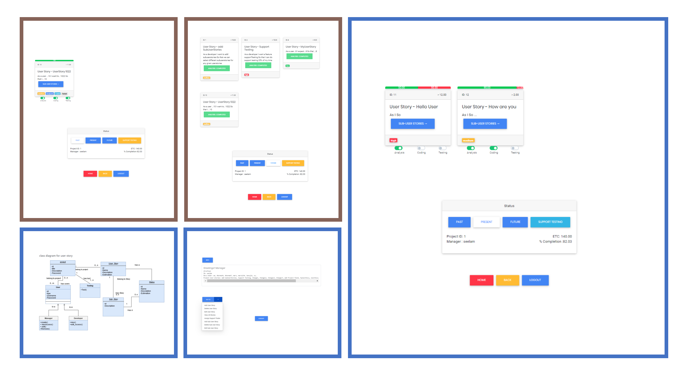
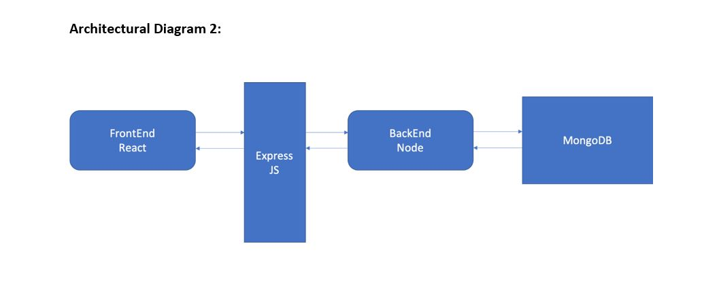
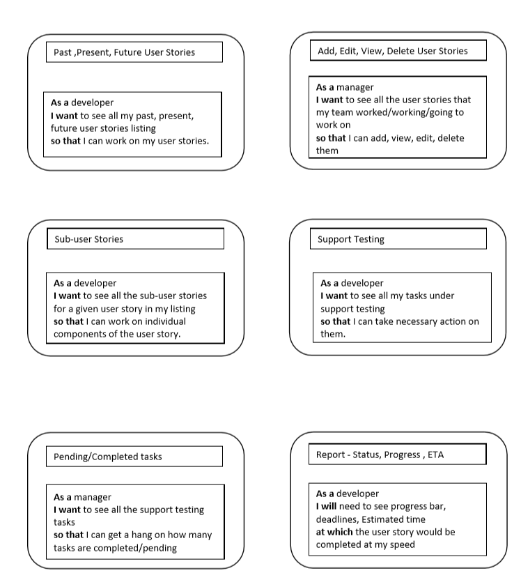
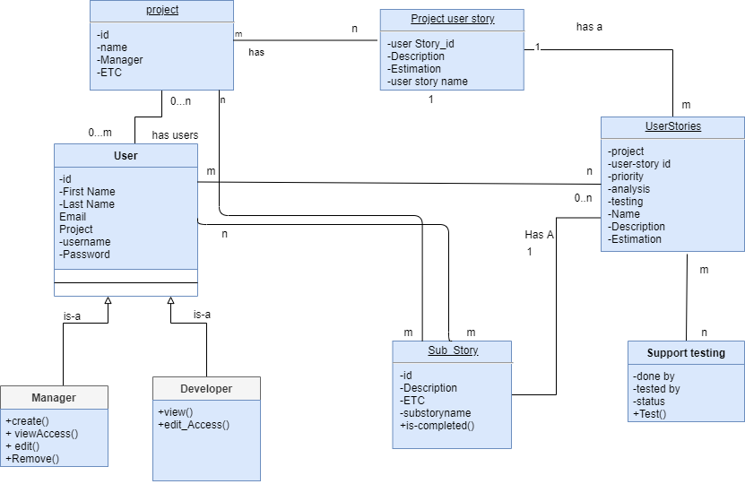
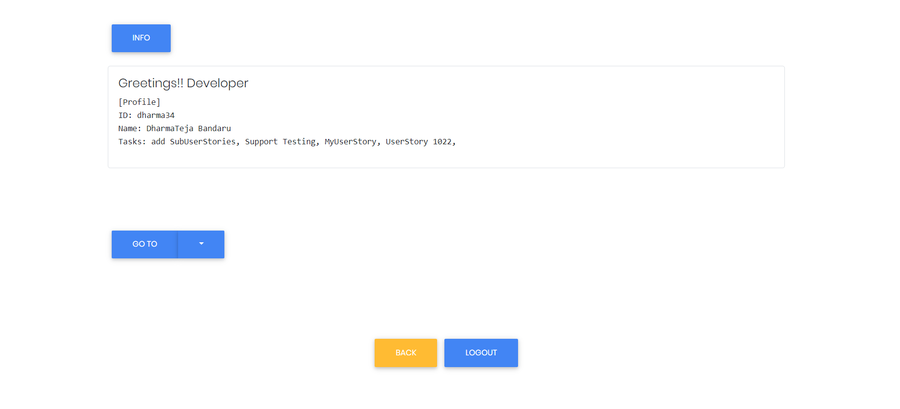
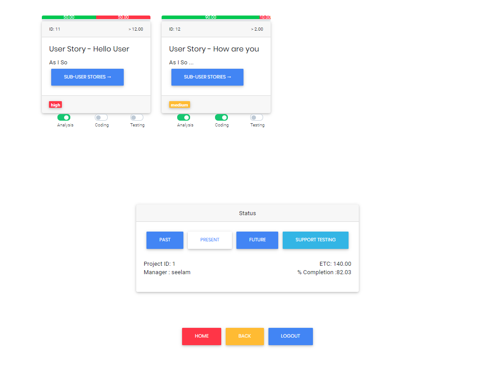

# User-Story-Tool 



# Introduction
This tool is intended to provide an end to end tracking of work done inside the project both for
individual developers and managers as well. 
<ul>
<li>The tracking is done mainly in the form of User stories
where in managers or people in similar level in the project assign requirements to developers in
the form of user stories. In software product development at industrial level user stories are a
formal way of describing the tasks that are to be done by the developers. 
</li><li>User stories describe the functioning of the system as seen by the user or from the user perspective. User stories can also be
used as metrics to judge the amount of work done by the developers and count the number of man
hours of work done by each individual and whole team in each time period. 
</li><li>User stories are useful in having an interactive communication with client as well as the users so that every concern of
the user can be captured and put into the project. Though user stories are high level description of
task in hand people in lower chain can break them down into sub user stories so that developers
can work in small chunks of works at each time. Doing this it also helps to analyze how much
amount of work is done on a user story or by any given developer. 
</li></ul>

# Technologies Used 
In this Project we have used ```React Js``` for the front end and ```Node Js``` for the back end. We have 
used ```MySQL``` as the database and Axios for integration process. Since NodeJS interprets the scripts 
directly into machine code it is easy to implement the program in an efficient manner. Also, there 
is abundant amount of help in the online community which has prompted us to use NodeJS. 
MySQL is being used vastly and most of the team members are well equipped for coding using 
MySQL and hence we have decided to use MySQL as our database.



# Requirements as User stories 


# Design 
## UML


## UI



# Team Organization and Tasks Sharing

Our team consists of 5 members namely Sanuj Kumar, Dharma Teja Bandaru, Hasan Al-Qudah, Vinay Reddy Mareddy, Carl Williams. We have divided the work equally between us. 
We worked on Agile basis for the project developing increments of work for every limited set 
of time period. The main issues we had during the project where to fix up our requirements, 
Integrate the module for front end and back end. We have also done testing for our tool and 
the results look promising. 
<ul>
<li>Front end – Sanuj Kumar & Hasan Al – Qudah.
<li>Back end – Vinay Reddy Mareddy & Dharma Teja Bandaru.
<li>Testing – The whole team.
</ul>
<br>
<p align="center">Thank you for reading!</span>
